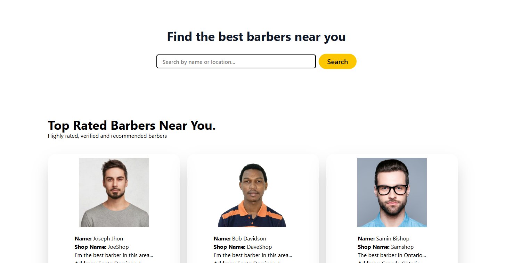
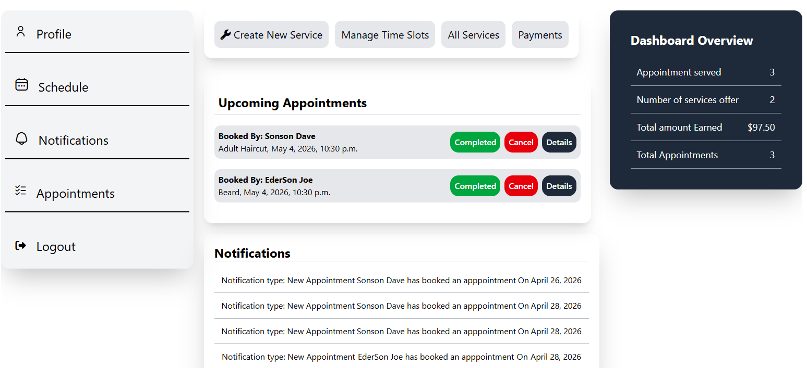
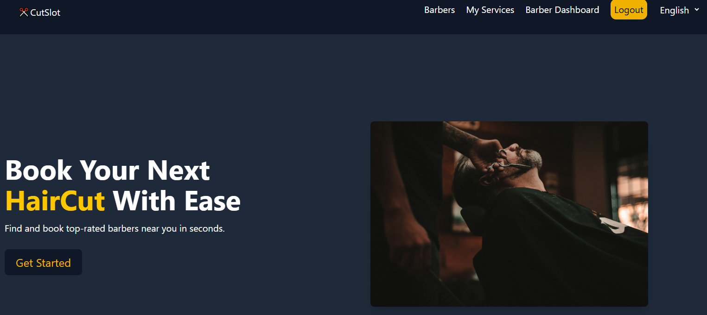
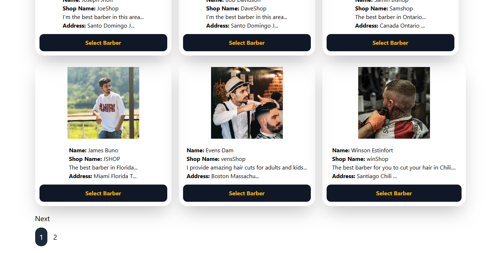
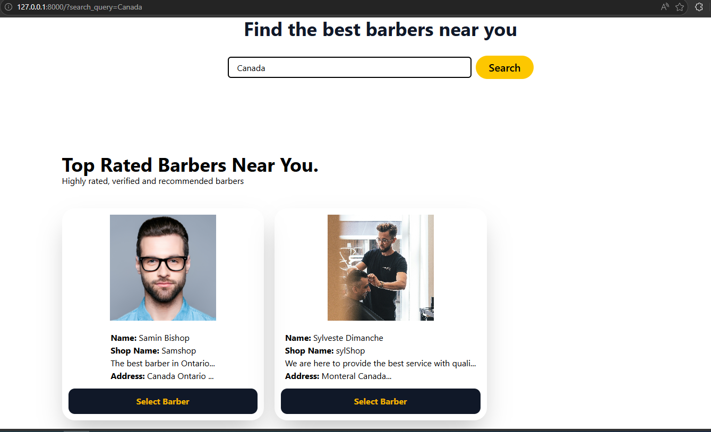
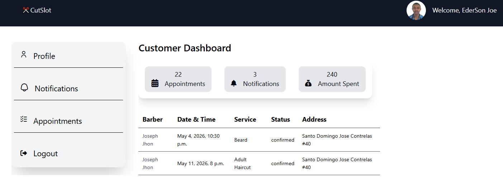

## Tech Stack Used for this Project
# Python ✅
# Django ✅
# Tailwind CSS ✅
# HTML ✅
# Postgresql ✅
# Stripe Payment Integration ✅
# Language Translation
# Booking system

## Project OverView
This application allows users to easily book appointments with nearby barbers. Barbers can create and manage their own services, while administrators are responsible for verifying each barber through their ID and profile picture before they are displayed on the homepage.

Barbers can manage appointments and create schedules based on their availability. When a user selects a date and clicks on “Get Available Time,” the system automatically generates available time slots, allowing users to choose the time that best fits their schedule.

Users also have flexible payment options, with the ability to pay either in cash or through online payment methods.

Users can choose whether they want to visit the barber’s shop or request a home service appointment. If a home service is selected, an additional fee will be applied, and users will be required to provide their address so the barber can travel to their location.

To make it easier for users to find the right barber, the application includes a search system that allows users to search by barber name, zip code, city, country, service, and other relevant filters.

## Features 
 # Users and barbers registration and authentication
 # Role-based registration
 # User and barber Profile management
 # Barber can create service and add available time per each day
 # User can book appointment with the closes barber to them
 # Online payments with Stripe or Cash payment
 # Cancel appointment
 # Reschedule appointment
 # Dashboard for barbers and users
 # Barber can track  the amount of money they have earned and the number of appointments they have completed.
 # Language translation

## Access Restrictions
# Barber can not book an appointment with themselves
# Users must be logged in,  in order to book an appointment
# Barber must be login to view the dashboard
# Barber can not see other barbers dashboard
# Barbers can not access user's dashboard
# Users can not access barber's dashboard
# Users can not have two(2) appointmens on the same day at the same time
# Barber can not see other barbers services list

## Installation & Setup
# git clone 
# cd barberapplication

## Create virtual environment
# python -m venv venv

## Activate environment
# Windows
  venv\Scripts\activate

# Mac/Linux
 source venv/bin/activate

## Install dependencies
 pip install -r requirements.txt

## Run migrations
You need to 
 python manage.py migrate

## Start server
    python manage.py runserver
    py manage.py tailwind start

## Future Improvements
 .Build a mobile app for the app
 .Add WebSockets notifications
 .Add Messaging system for users and barbers to communicate
 .Create an API endpoint for the app and consume it with React
 .Add Docker support
 .Deploy AWS
 .Add Redis cathing
 .Add Background tasks with Celery

